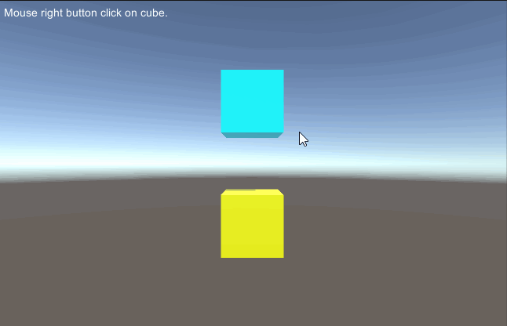

# MGS-ContextMenu
- [中文手册](./README_ZH.md)

## Summary
- Unity plugin for make context menu UI in scene.

## Demand
- In Unity scene, show context menu when mouse right button click on
  the target gameobject and click the menu item to do something.

## Environment
- Unity 5.0 or above.
- .Net Framework 3.0 or above.

## Achieve
- ContextMenuUI : Control the context menu UI(UGUI).
- ContextMenuTrigger : Trigger of context menu, show context menu on
  mouse right button click on the target
  gameobject.
- ContextMenuAgent : Agent of context menu, achieve the action of
  context menu item is clicked.
- In fact, this plugin just build a frame of context menu, you need
  write your component script, inherit the ContextMenuAgent class and
  achieve the OnMenuItemClick method to something that you want, and
  attach it to the target gameobject. just like the ContextMenuAgentExample
  component.

## Demo
- Demos in the path "MGS-ContextMenu\Scenes" provide reference to you.

## Preview
- Context Menu Example

## Contact
- If you have any questions, feel free to contact me at mogoson@outlook.com.
