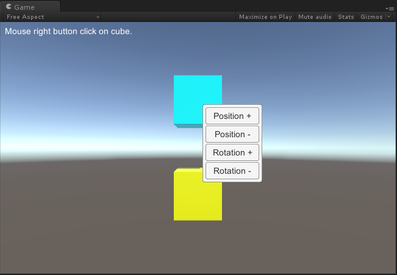

# MGS-ContextMenu
- [English Manual](./README.md)

## 概述
- Unity 制作UGUI上下文菜单 插件包。

## 需求
- Unity 场景中，鼠标右键点击目标物体时弹出上下文菜单，点击菜单项时对目标物体执行相应的操作。

## 环境
- Unity 5.0 或更高版本。
- .Net Framework 3.0 或更高版本。

## 实现
- ContextMenuType：上下文菜单分类。
- ContextMenuUI：管理上下文菜单UI。
- ContextMenuTrigger：上下文菜单触发器，鼠标右键单击物体时触发菜单显示。
- ContextMenuAgent：上下文菜单代理，实现菜单项被点击时需要执行的操作。

- 实际上是搭建了一个右键上下文菜单的简易框架，读者需要自己编写代码组件，通过继承ContextMenuAgent
类并具体实现其OnMenuItemClick方法来实现菜单项被点击时需要执行的操作，并将代码组件挂载到目标物体。
例如演示案例中的ContextMenuAgentExample组件。

## 案例
- “MGS-ContextMenu\Scenes”目录下存放上述功能的演示案例，供读者参考。

## 图示
- ContextMenuExample

## 联系
- 如果你有任何问题或者建议，欢迎通过mogoson@qq.com联系我。